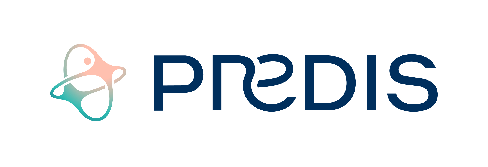
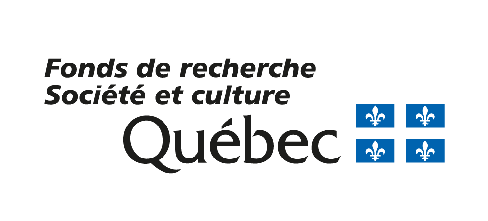

# Intro_Deep_Learning_Food101

## Description
L'ensemble du projet est un cours à la classification d'images d'aliment grâce à l'apprentissage profond, passant par la définition de différents concepts autour des réseaux de neurones et leur entraînement. Afin de pouvoir rouler ce projet il est nécessaire d'avoir accès à un GPU (Cette demande peut être faite à travers votre centre de recherche, ne pas hésiter à demander de l'aide sur le slack de l'école d'été). L'ensemble du code va être très lent à rouler sur colab ou autre plateforme de calcul gratuite, il est donc conseillé de maîtriser un minimum les commandes bash dans le terminal et d'avoir un éditeur de code sur votre ordinateur (nous recommandons Google Colab). Pour toute question vous pouvez contacter les auteurs ci-dessous.

## Authors and acknowledgment
- Tess Berthier (PREDIS) - Development du TP original 
- Antoine Dufour (PREDIS) - Development du TP original 
- Gabriel Leclerc (PREDIS) - Development du TP original 
- Jean-Pierre Clement (IID et INAF) (jean-pierre.clement@iid.ulaval.ca) - Modification du TP original pour l'école d'été de 2025

## License
 [CC BY-NC-ND 4.0 ](https://creativecommons.org/licenses/by-nc-nd/4.0/?ref=chooser-v1)

